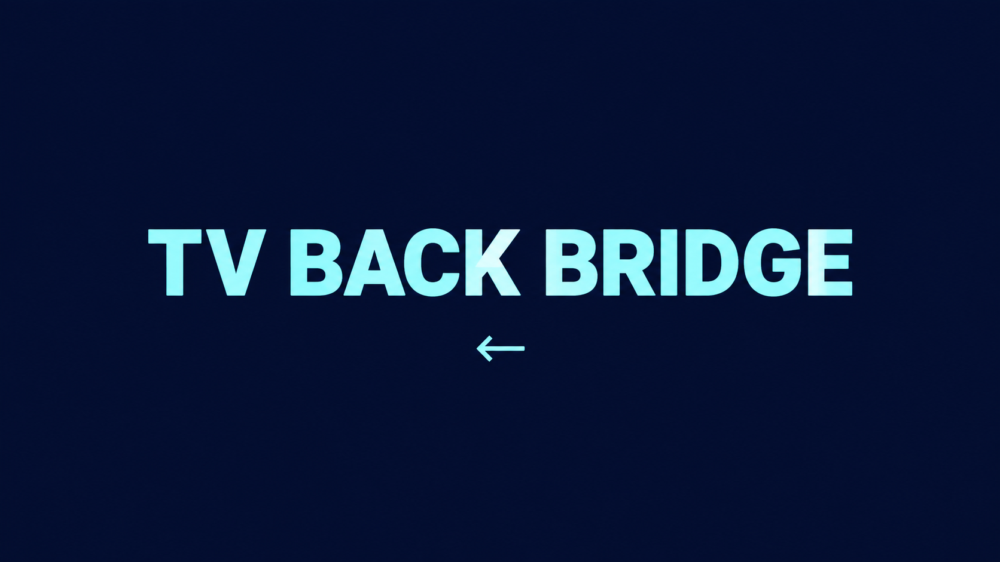

# TV Back Bridge



TV Back Bridge is an independent Jellyfin plugin that maps a TV remote's Back key to Jellyfin Web navigation. It has been tested on one Toshiba VIDAA TV, whose remote sends `Backspace` with key number `8`. Those are the default settings. Other remotes can be identified with the on-screen key viewer and configured in the plugin settings.

The plugin injects its script when Jellyfin serves its web page. The script activates when the web client's user agent contains `vidaa`, `hisense`, or `toshiba`, or the TV exposes `Hisense_GetFirmWareVersion`.

**Status:** Version 0.1.0 has been tested on a Toshiba VIDAA TV for library and film navigation. Version 0.1.1 fixes the key viewer so it keeps the physical remote key visible after the plugin sends Jellyfin's Back event. Version 0.1.1 passes local tests and is awaiting a TV test.

## Install from Jellyfin's plugin catalog

1. In Jellyfin, open **Dashboard → Plugins → Repositories** and add `https://raw.githubusercontent.com/lewiswatson55/TVBackBridge-Jellyfin/main/manifest.json`.
2. Open **Catalog**, find **TV Back Bridge**, and install it.
3. Restart Jellyfin. Open **Dashboard → Plugins → My Plugins** to check that it is active.

This build targets Jellyfin **10.11.5**. Later Jellyfin versions need a compatibility build and test.

## Install manually

1. Download `TVBackBridge_0.1.1_Jellyfin-10.11.5.zip` from this repository's Releases page and extract `Jellyfin.Plugin.VidaaBack.dll`.
2. Copy the DLL into a new folder named `TVBackBridge_0.1.1` inside Jellyfin's plugins directory. On **my** tested Linux install, the full destination is `/var/lib/jellyfin/plugins/TVBackBridge_0.1.1/Jellyfin.Plugin.VidaaBack.dll`.
3. Make the new folder **and its DLL** owned by the account running Jellyfin. Jellyfin must be able to write `meta.json` into this folder during startup.
4. Restart Jellyfin and check **Dashboard → Plugins → My Plugins** for **TV Back Bridge**.

A manual DLL install may show **“An error occurred while getting the plugin details from the repository”** on the plugin details page. Jellyfin creates the local `meta.json` itself; that message concerns the separate repository manifest. Catalog installation uses the published manifest and release ZIP.

## Use the standalone script instead

If you prefer not to install the plugin, follow the short [manual Back fix instructions](MANUAL.md) to add `vidaa-back-manual.js` to Jellyfin Web. Use either the script or the plugin, not both.

## Configure

The defaults are `Backspace` and `8` and should work however if this still doesnt work your remote may use a different key.

Open **Dashboard → Plugins → TV Back Bridge → Settings** on a laptop or phone. To test what key your remote uses you can:

- Turn on the TV key viewer to see the physical remote key name and number. Reload Jellyfin on the TV after saving. Turn the viewer off when setup is complete.
- Change the key name or number. Either match activates Back. Use number `0` to match only the name, or leave the name blank to match only the number.

In testing, my TV app didnt have access to the admin portal. Open Jellyfin's admin dashboard on a laptop or phone and update the settings on there. Setting changes take effect when the TV reloads the Jellyfin web page so exit the app and open it again.

## Build

Requires the .NET 9 SDK.

```sh
dotnet build src/Jellyfin.Plugin.VidaaBack.csproj -c Release
```

The plugin is not affiliated with Jellyfin, VIDAA, Hisense, or Toshiba.
